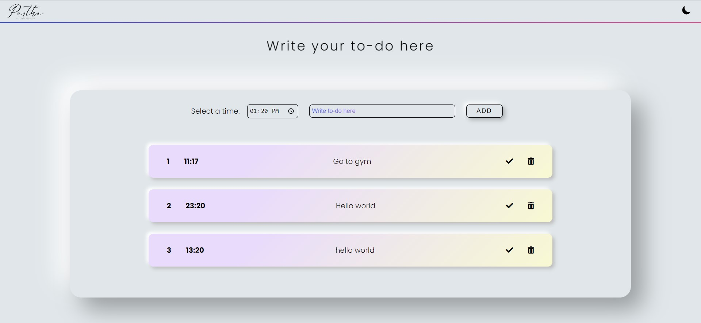
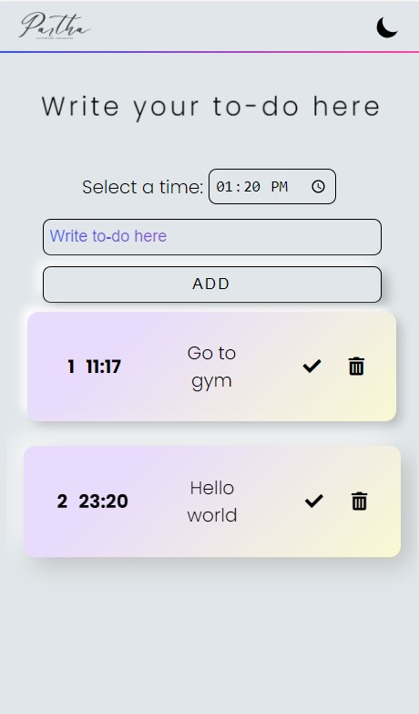
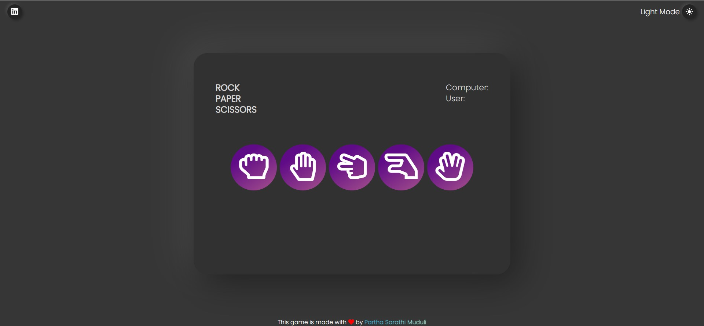

# simple-to-do-app
A simple to do app using html, css and js.

Here, user can add a task, delete a task and mark a task as completed.

###  You can view the webpage [here](https://basic-to-do-app.netlify.app/)

---
## Screenshot

### Light Mode

### Popup in light mode

### Light mode in small screen

### Dark Mode

### Popup in dark mode

### Dark mode in small screen

---

## Tech Stack 
- Html
- Css
- JavaScript
- Animate.css
- jQuery

---

## Contributing
Contributions are welcome. Please open an issue or a pull request on [GitHub](https://github.com/partha7978/simple-to-do-app)

Copyright (c) 2022 <a href="https://parthasarathimuduli.netlify.app/" target="_self">Partha Sarathi Muduli</a>