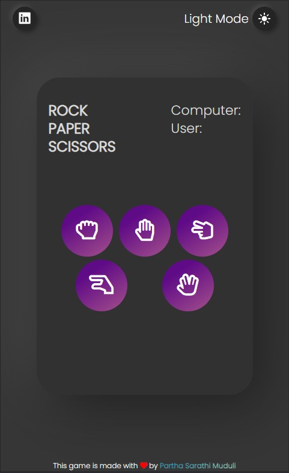

# simple-to-do-app
A simple to do app using html, css and js.

Here, user can add a task, delete a task and mark a task as completed.

###  You can view the webpage [here](https://basic-to-do-app.netlify.app/)

---
## Screenshot

### Dark Mode

### Popup in darkmode

### Dark mode in small screen

---

## Tech Stack 
- Html
- Css
- JavaScript
- Animate.css
- jQuery

